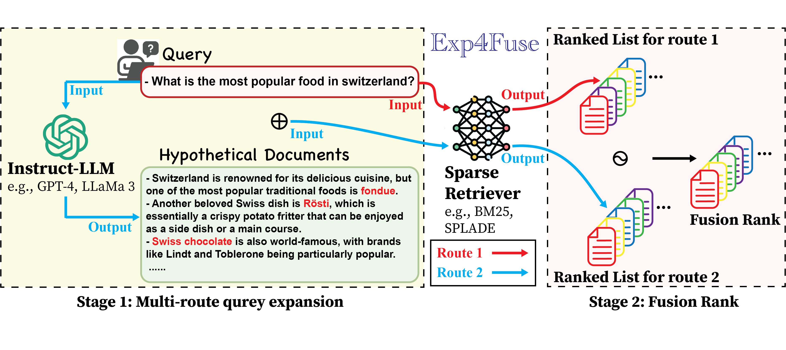

## Exp4Fuse: A Rank Fusion Framework for Enhanced Sparse Retrieval using Large Language Model-based Query Expansion

**📢 News: this work has been accepted at the ACL 2025 findings!** [paper](https://arxiv.org/abs/2506.04760)

We propose Exp4Fuse, a query expansion method using a LLM to enhance sparse retrievers. Exp4Fuse fuses two sets of retrieved document ranks from the same sparse retriever: one based on the original query and the other on an LLM-based zero-shot query expansion, to generate final retrieved document ranks. This method benefits from indirect LLM-based QE and combines results from different query formats, yielding high-quality retrieval outcomes.



Exp4Fuse can effectively perform zero-shot QE for various sparse retrievers, particularly learned sparse retrievers. Extensive experiments  demonstrate that Exp4Fuse outperforms existing LLM-based query expansion methods. Furthermore, when combined with advanced sparse retrievers, Exp4Fuse surpasses some SOTA baselines and remains competitive with others.


## 1 Requirements

```bash
pip install transformers==4.30.2
pip install beir==1.0.1
pip install datasets==2.14.1
pip install tqdm
pip install scipy
pip install evaluate==0.2.2
pip install spacy==3.7.2
pip install accelerate
pip install elasticsearch==7.17.9
pip install pyserini
pip install fassi-cpu
pip install numpy
pip install nltk
```
or
```bash
bash install.sh
```

## 2 Resourse
### 2.1 Prebuilt faiss index

Install [pyserini](https://github.com/castorini/pyserini#-installation) and download the [prebuilt faiss index](https://github.com/castorini/pyserini/blob/master/docs/prebuilt-indexes.md) for 'msmarco-v1-passage.ance','msmarco-v1-passage.aggretriever-cocondenser','msmarco-v1-passage.aggretriever-distilbert','msmarco-v1-passage.tct_colbert-v2'. We use pyserini to conduct retrieval and evaluation.

### 2.2 Example Hypothesis Documents
We provide example hypothesis documents generated using 'gpt-4o-mini' in the following directory:
*TREC DL19 data/dl19_hypothesis*


## 3 Run

Run 'Exp4Fuse-demo-dl19.ipynb', it will run the experiments for Exp4Fuse on the TREC DL19 dataset in six embeddings. 

## Citation

```
@misc{liu2025exp4fuserankfusionframework,
      title={Exp4Fuse: A Rank Fusion Framework for Enhanced Sparse Retrieval using Large Language Model-based Query Expansion}, 
      author={Lingyuan Liu and Mengxiang Zhang},
      year={2025},
      eprint={2506.04760},
      archivePrefix={arXiv},
      primaryClass={cs.IR},
      url={https://arxiv.org/abs/2506.04760}, 
}
```
